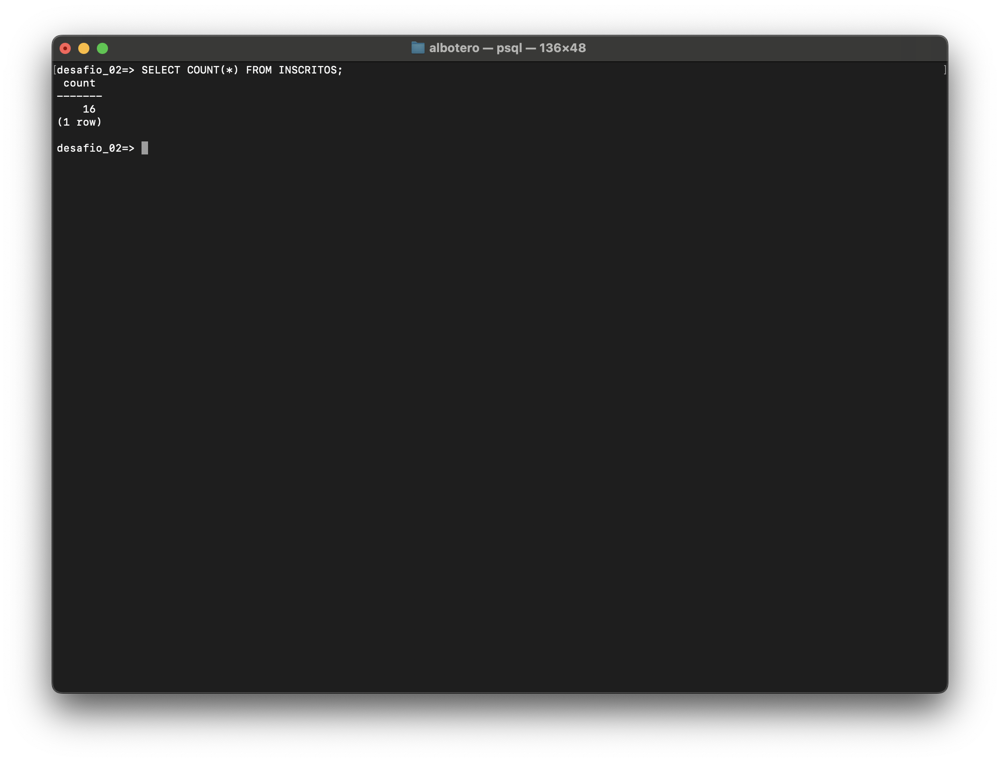
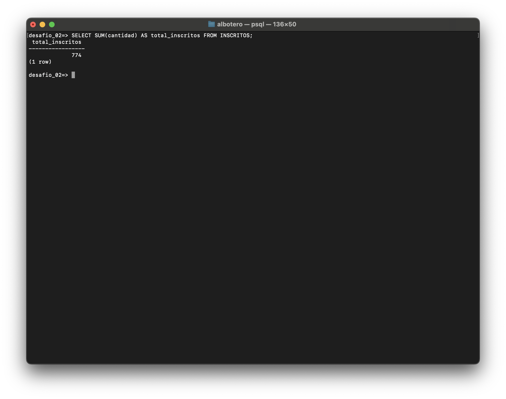
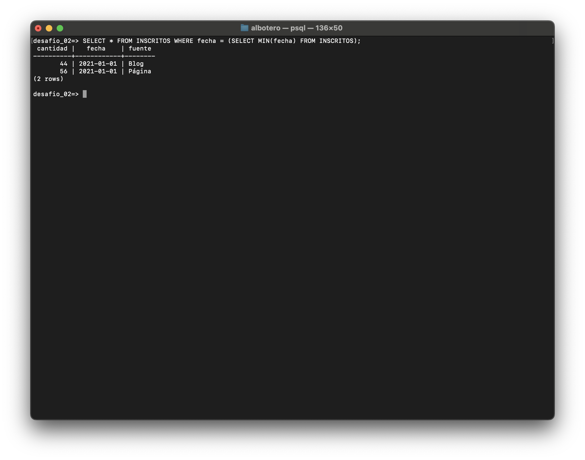
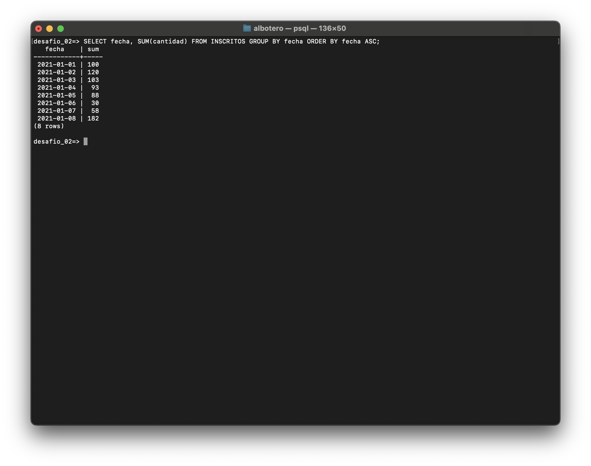
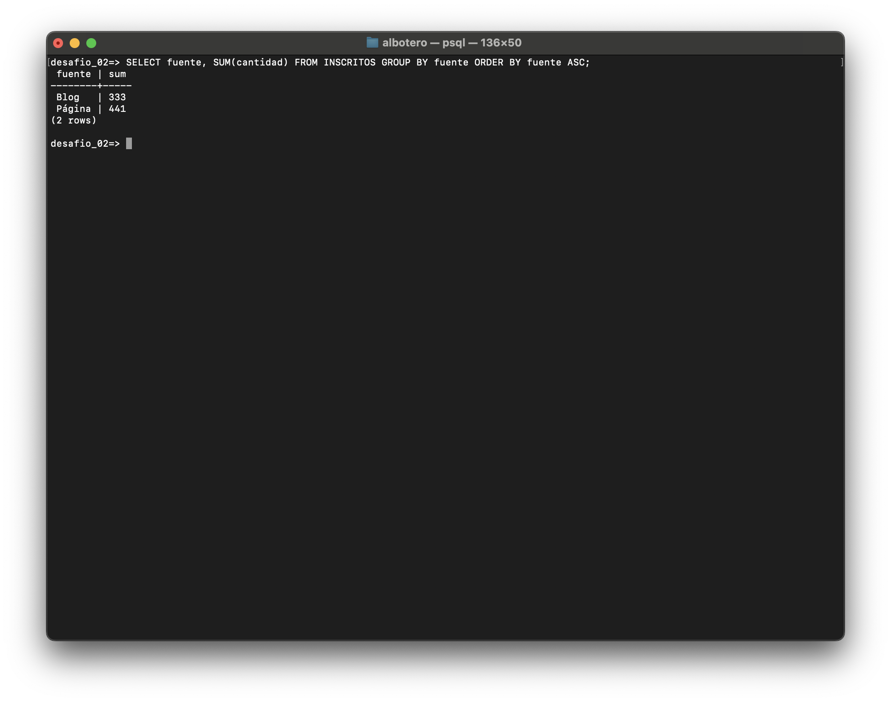
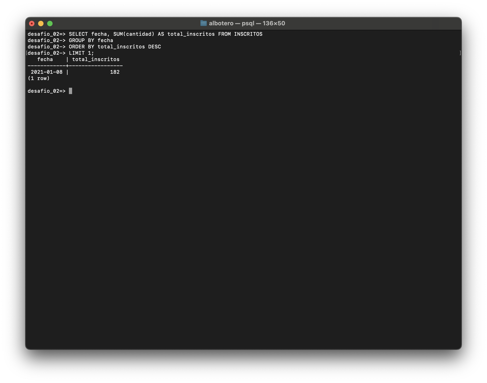
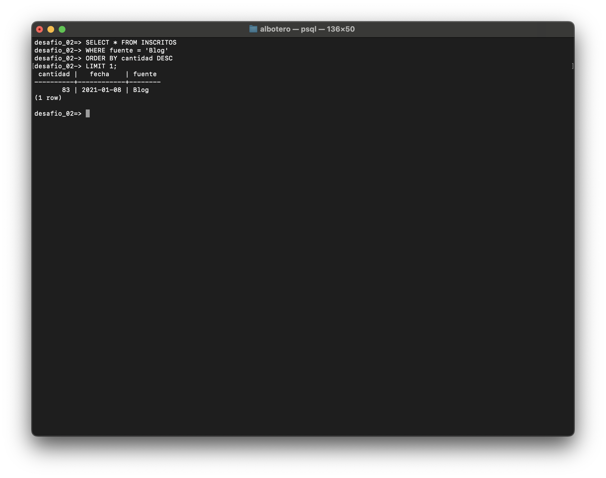
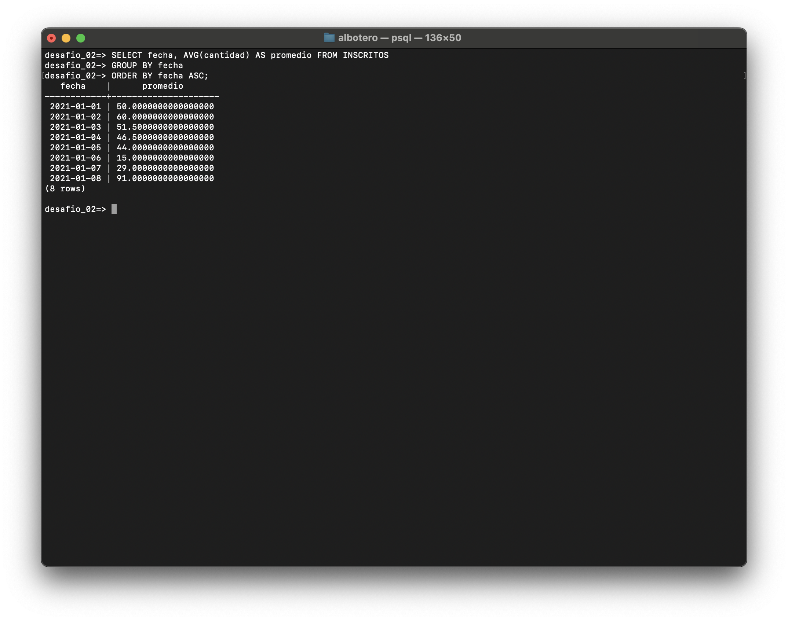
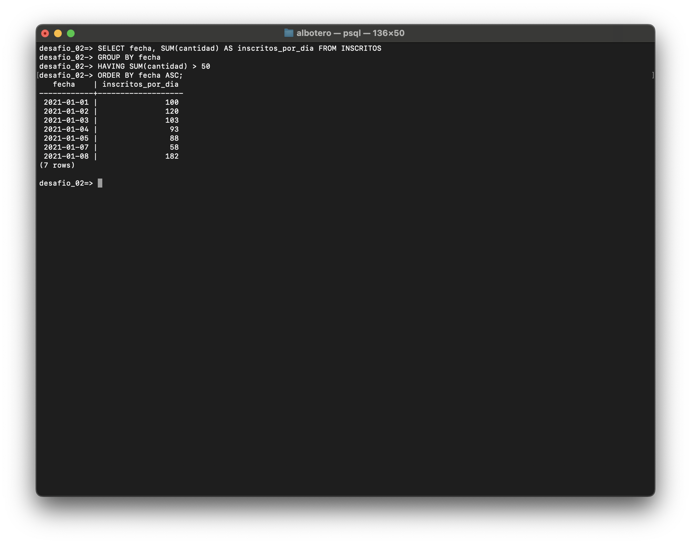
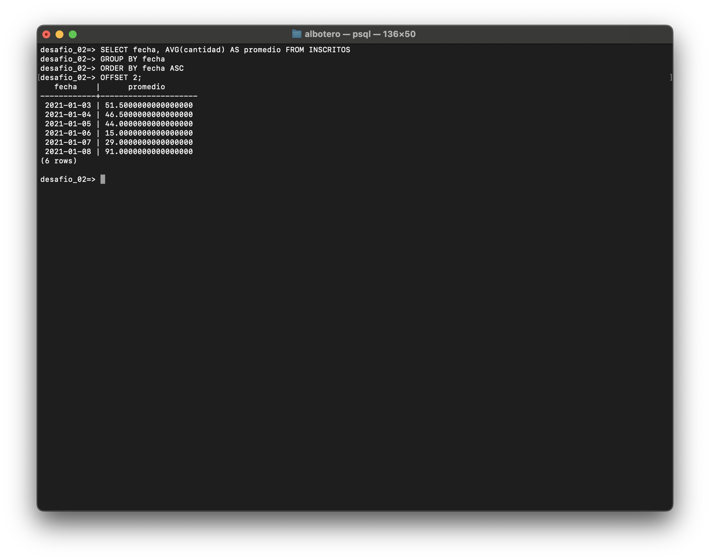

# DESAFIO 2 - SQL

## Archivo SQL

[Archivo SQL con los requerimientos](/desafio_02_consultas_agrupadas.sql)

## Requerimientos

### 1. ¿Cuántos registros hay?

```sql
SELECT COUNT(\*) FROM INSCRITOS;
```



### 2. ¿Cuántos inscritos hay en total?

```sql
SELECT SUM(cantidad) AS total_inscritos FROM INSCRITOS;
```



### 3. ¿Cuál o cuáles son los registros de mayor antigüedad?

```sql
SELECT \* FROM INSCRITOS WHERE fecha = (SELECT MIN(fecha) FROM INSCRITOS);
```



### 4. ¿Cuántos inscritos hay por día? (Indistintamente de la fuente de inscripción)

```sql
SELECT fecha, SUM(cantidad) FROM INSCRITOS GROUP BY fecha ORDER BY fecha ASC;
```



### 5. ¿Cuántos inscritos hay por fuente?

```sql
SELECT fuente, SUM(cantidad) FROM INSCRITOS GROUP BY fuente ORDER BY fuente ASC;
```



### 6. ¿Qué día se inscribió la mayor cantidad de personas? Y ¿Cuántas personas se inscribieron en ese día?

```sql
SELECT fecha, SUM(cantidad) AS total_inscritos FROM INSCRITOS
GROUP BY fecha
ORDER BY total_inscritos DESC
LIMIT 1;
```



### 7. ¿Qué día se inscribieron la mayor cantidad de personas utilizando el blog? ¿Cuántas personas fueron? (si hay más de un registro con el máximo de personas, considera solo el primero)

```sql
SELECT \* FROM INSCRITOS
WHERE fuente = 'Blog'
ORDER BY cantidad DESC
LIMIT 1;
```



### 8. ¿Cuál es el promedio de personas inscritas por día? Toma en consideración que la base de datos tiene un registro de 8 días, es decir, se obtendrán 8 promedios.

```sql
SELECT fecha, AVG(cantidad) AS promedio FROM INSCRITOS
GROUP BY fecha
ORDER BY fecha ASC;
```



### 9. ¿Qué días se inscribieron más de 50 personas?

```sql
SELECT fecha, SUM(cantidad) AS inscritos_por_dia FROM INSCRITOS
GROUP BY fecha
HAVING SUM(cantidad) > 50
ORDER BY fecha ASC;
```



### 10. ¿Cuál es el promedio por día de personas inscritas? Considerando sólo calcular desde el tercer día.

```sql
SELECT fecha, AVG(cantidad) AS promedio FROM INSCRITOS
GROUP BY fecha
ORDER BY fecha ASC
OFFSET 2;
```


